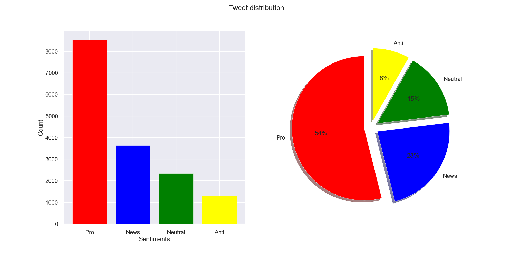
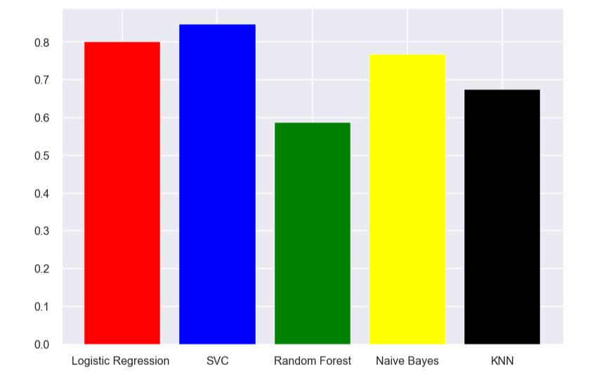

# Sentiment Analysis Project using Natural Language Processing.
## Planet Solver - A Product Pitch by Emerald; a team of Data Scientists
Many companies are built around lessening environmental impact or carbon footprint. They offer products 
and services that are environmentally friendly and sustainable, in line with their values and ideals.

Emerald, a team of Data Scientists in this project pitched a product that can help companies to determine 
how people perceive climate change and whether or not they believe it is a real threat. This would add 
to their market research efforts in gauging how their product/service may be received.

### Task
Emerald was challenged in the Classification Sprint with the task of creating a Machine Learning model 
that is able to classify whether or not a person believes in climate change,  based on their novel tweet data.

### Objective
Providing an accurate and robust solution to this task gives companies access to a broad base of consumer 
sentiment, spanning multiple demographic and geographic categories - thus increasing their insights and 
informing future marketing strategies.

## Exploratory Data Analysis

- Data Cleaning and Exploratory Data Analysis (EDA): The Data was cleaned and important visualizations about the available data were carried out.

Based on the data set used in the project, below is the tweet distribution with class Pro having a very high frequency.

 

Because of the imbalance in the dataset, a resampling was done on the dataset during the data engineering phase of the project.

- Data Engineering: The text data set was put in a format that can be used in a machine learning algorithm.

## Model Evaluation

The evaluation metric for the Kaggle competition was Weighted F1-score Prediction of an individual's climate change sentiment class is commonly used in classifications problems.

After comparison of the different models, the support vector classifier (SVC) was selected as it gave the best performance among the tested models using the F1-score as shown below.

## Kaggle Submission

The random forest model was used to make a submission on Kaggle for the [Spain Electricity Shortfall challenge](https://www.kaggle.com/competitions/spain-electricity-shortfall-challenge-2022/leaderboard) where my team was able to attain an 8th position on the leaderboard after a lot of fine-tuning of the model.

- Machine Learning Model training: Different machine learning models were considered; Logistic Regression,
  Support Vector Classifier, Random forest classifier, Naive Bayes classifier, and K Nearest Neighbour classification.

- Model Performance: This was tracked using Comet, a web-based platform used for keeping records of machine learning model performance.
  The model with the best performance, SVC, was selected and used to make predictions that were used for the Kaggle competition.

- Recommendations: These were made based on the result of the project.

## Streamlit

Streamlit is an open-source app framework in Python language that is used to create web apps for data science and machine learning in a short time. 

The [Streamlit web application](https://sentiment-analysis-on-climate-change.streamlit.app/)

A video demo of the Streamlit app being used is at [Web app video demo](https://drive.google.com/file/d/1eweMv369ICT-a3ZN4E6qsE9UxlBDqlFs/view?usp=drive_link)

## The Pitch.
The Product was pitched to a panel of stakeholders and the pitch presentation is at [Product Pitch](https://www.canva.com/design/DAFDvHeY0N8/gEwp_FiznbPwkxQt7uqGSQ/edit?utm_content=DAFDvHeY0N8&utm_campaign=designshare&utm_medium=link2&utm_source=sharebutton).
